# Help

Learn how to get started with MusicBee Remote

## Plugin

### Downloading

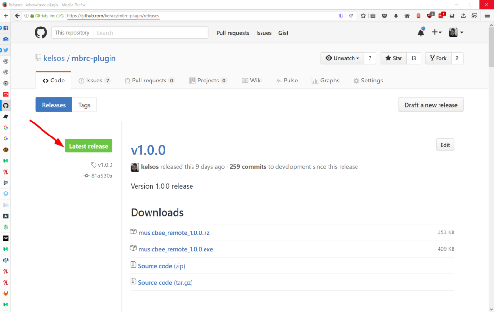

Before starting to use MusicBee Remote you first have to download the plugin on your PC.
You will require the latest release available if you installed the application from Play
Store.

The plugin can be found either on [GitHub](https://github.com/kelsos/mbrc-plugin/releases),
or at the MusicBee [Plugins](http://getmusicbee.com/addons/plugins/75/musicbee-remote-plugin) page.

There are two actual ways to install the plugin on your computer. The automated way through
the musicbee_remote\*.exe installer and the manual installation by using the 7z archive.
7z is definitely the way to go if you are running the portable version of MusicBee.

### Installation

If you are doing the installation through the 7z archive,
the installation is pretty straightforward.
You just have to extract the archive's contents in the **Plugins** folder of MusicBee.
If you are running the portable version just locate your **MusicBee\Plugins** folder
and extract the contents. If you just want to use the archive on a regular installation you can
usually locate the Plugins folder under **C:\Program Files (x86)\MusicBee\Plugins**.

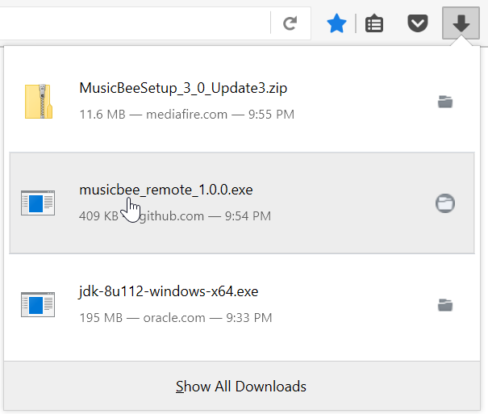

If you already downloaded the installer, you can proceed with the installation.
The installer is not digitally signed, so if you have UAC enabled, you will
get a warning about the application being published by an unknown publisher.
Make sure that the Plugin was downloaded from one of the two sources
mentioned above and you should be safe.

Once you start the installation it can be completed in 5 simple steps as you can see below.
Just make sure that during the plugin installation MusicBee is not actually running.

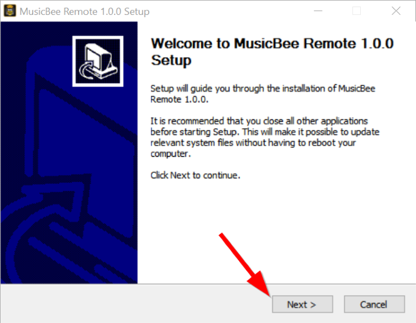
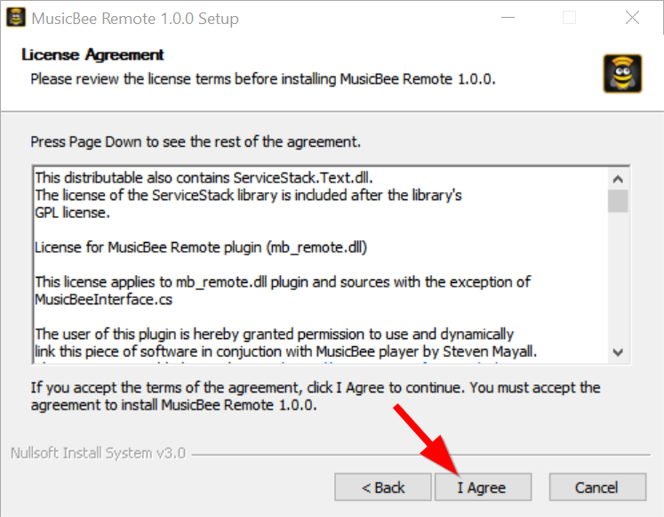
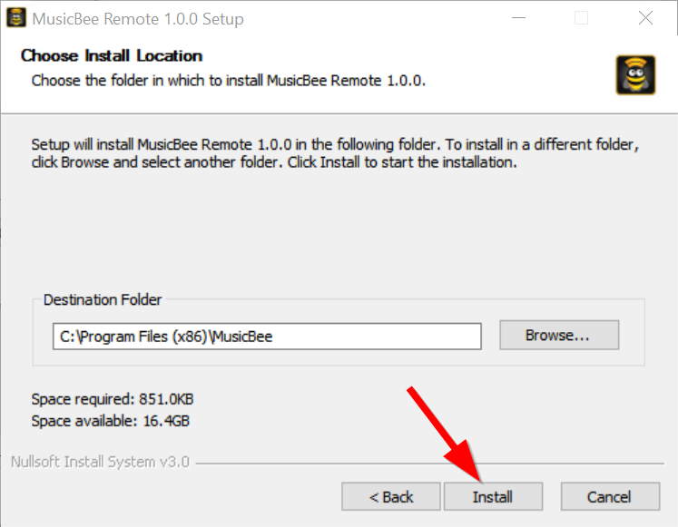
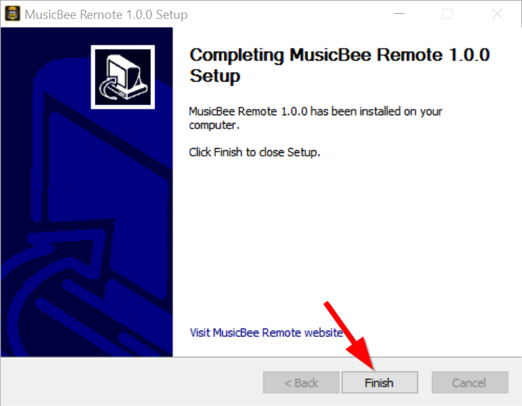
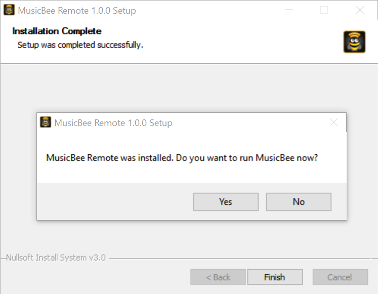

After the installation is complete you can proceed with the configuration of the plugin

### Configuration

During your first run the plugin setup dialog will appear.

**Important!** Changes will not be saved unless you save them.

1. The first field displays the socket status. If the status is
   _Running_ it means that the plugin is active an listening for
   incoming connection. This is the normal status and it should not be
   Stopped. If your status is stopped then something has gone terribly wrong.

2. The first field is the plugin's listening port. This is important for the application
   configuration. The default port is 3000 but it can change to accommodate your needs.
   Make sure that the port you choose is not currently in use by any other application
   on your computer.

3. The plugin supports IP filtering which means that it can essentially block
   connections that have different addresses than the ones specified. By default
   it is configured to accept all the incoming connections.

- **Range Filter**: When you select the Range filter you essential block access
  to any device that has an address that doesn't belong to the specified range.
  e.g. You select 192.168.90.1 in the address field and 10 to the end part
  this will allow connections only from the IP addresses **\*192.168.90.1**
  to **192.168.90.10**. Essentially if your phone has an IP address that is
  not in this range it will be denied access and it will be not able to connect.

  > **Important!** If you insert a reverse range e.g. _192.168.90.10 - 8_
  > this effectively blocks all connections and no client will be able to
  > actually connect on the plugin.

- **Specified Filter**: It blocks all the addresses but allows connection for the whitelisted addresses.
  You can view the whitelisted addresses on the drop down menu.
  To add a new address in the whitelist you have to type it in the **Address** field and press
  the **+** button. The address will be added to the whitelist.
  To remove an address enter select the address from the
  drop down and press the **-** button. Essentially if you use this
  type of filtering and add for example the **192.168.1.2** and **192.168.1.3**
  addresses in the whitelist, your application will not be able to connect
  unless your Phone's IP address is either **192.168.1.2** or **192.168.1.3**.

4. In the address list you can see the IP addresses for the network interfaces on your PC.
   In case the automatic detection of the connection settings doesn't work this should help you
   manually configure the application along with the port. If you have more
   than one network interfaces/addresses the one you need is the one that
   is in the same network with your Android device.

5. In the latest version the plugin has the ability to enable debug logging. This can be done by
   checking the checkbox Debug Log **(5)**. You can open the log directly by pressing the
   **Open Log** button. This should open the log file on Notepad. You can find the log file under
   **%AppData%\MusicBee\mb_remote\error.log**.

6. Opens the log file in Notepad.

7. In the latest version there is also a small exe included called firewall-utility. If you enable
   the option, when saving the new settings the plugin will start the firewall-utility passing
   the new port as parameter.
   Since changing firewall rules requires administrative rights there will
   be a prompt for permission to run as administrator. If the permission is given the utility will
   automatically create a firewall rule allowing traffic through the port selected in the settings.

8. Saves and applies tha changes. If not pressed any change will be
   lost as soon as the panel closes.

9. Opens this page on the default browser.

If you ever need to reopen the settings panel after the first run you can do this by
opening the MusicBee menu going to **Tools** and selecting **MusicBee Remote**.:

> If you are unable to locate the menu entry you should check if the plugin
> is actually enabled.

## Application

### Installation

There are two ways to install the application. If you have access to
Google Play Store the application is available for direct download.

Search for "MusicBee Remote" and install like every other application.

Alternatively there are two apks available on the project [GitHub](https://github.com/kelsos/mbrc/releases) page.
The play release is the same version that is uploaded to the Play Store and uses
the Crashlytics SDK to track crashes, on the other hand the github
release is without Crashlytics and doesn't track any crashes.

In the second case you have to download the apk on your device and enable
the _installation of non-market apps_ on your android device. A quick
google search will provide you with information on how to enable
the installation of non-market applications.

### Connection

In version 1.0.0 the application should normally be configured automatically.
There is a mechanism in place that runs the discovery functionality automatically
when the application starts and if a remote host is detected it should
connect without requiring input from the user.

If for some reason the automatic discovery doesn't work for you then
you have to configure the application manually.

You need two pieces of information in order to manually configure the application.
The first one is the **IP address** of the pc running the plugin.
This is available in the Address list of the plugin settings panel.

> **Important!** If you have multiple network interfaces keep in mind the the one
> you need is the one that is in the same network as your Android device

The second one is the listening port _(the default is 3000)_. This is also
available on the plugin settings panel.

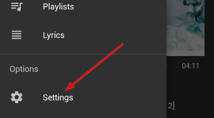

In order to configure the connection manually you have to open the side
**navigation menu** select the **Settings** entry and when the settings
open you have to select the **Manager Connections**.

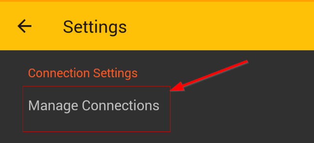

This will open the connection manager screen where you either can
change the default settings, manually add, delete or edit existing connection settings,
or start the discovery function manually.

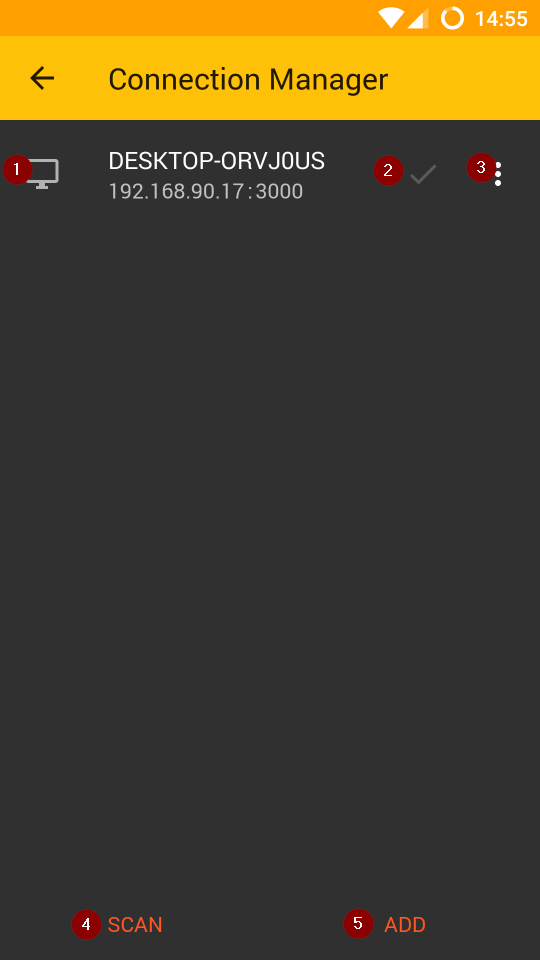

1. This represent a connection entry. You can see the name of the device in the
   first line and the **IP address** and **Port** combination on the second line.

2. The check mark represents the default (active settings). If you have multiple
   entries keep in mind that the app will try to connect to the one
   with the check mark.

3. The popup menu of the connection manager offers you the options set
   the selected connection settings as default, delete or edit the selected
   connection settings.

4. It will initiate the automatic service discovery.

5. Opens a dialog to manually enter the connection settings. The IP address and port
   can be found on the plugin's settings panel.

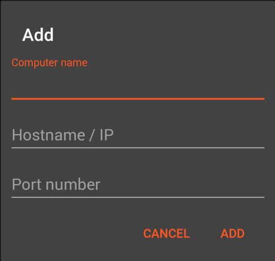

After adding the new connection _(and setting it defeault)_ if everything is OK
the application should connect automatically.

### Other Settings

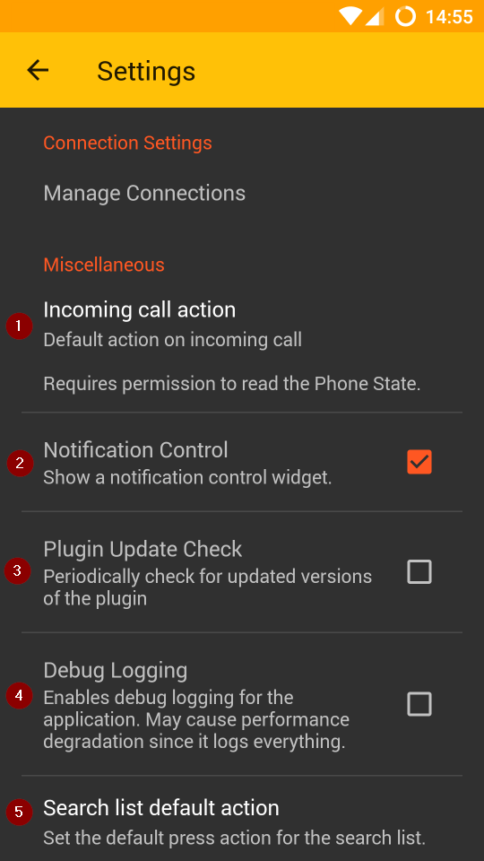

1. When enabled it performs a preselected action when there is an incoming call while the application is connected.
   The option is disabled by default and requires the PHONE_STATE permission in order to work.
   There are three actions that can be performed.

   - **Reduce Volume**: Reduces the volume to the 20% of the current volume
   - **Stop**: Stops the playback on incoming call.
   - **Pause**: Pauses the playing track on incoming call.

2. Enables the Notification shown by the application. This is by default enabled.
   **Important!** _Keep in mind that due to recent changes in the way services work, the notification is
   required to ensure the proper operation of the application._

3. It should periodically check for updated versions of the plugin and notify the user about the updates.
   Currently broken.

4. When enabled it keeps logs of the application operation.
   These logs can be attached to the mail created by the **Feedback** screen.

5. This option is a leftover from pre v1.0.0 and it is planned to change how it works in v1.0.2.
   It allows you to change the default action when pressing an item on the library,
   (e.g. an Artist, Album etc). The available actions are **Play Now**,**Queue Last**, **Queue Next**,
   and **Open Subcategory**, Open Subcategory is not available for Tracks.
   This was useful in previous versions with the search functionality however
   from version 1.0.2 this will affect only the tracks. It will allow you to
   select the default action when clicking on a track entry. For Genres, Artists and Albums
   it will open the view to display the subcategory data for the selected entry.

### Application Main Screen

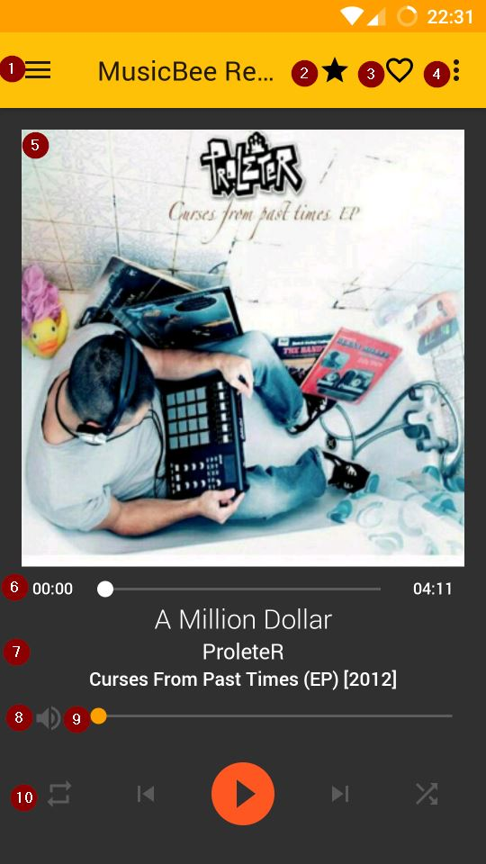

1. **Hamburger menu**: Opens the application navigation menu.

2. **Rating Star**: Opens the rating dialog that allows you rate the playing track.

3. **Love Icon**: Adds the track as a favorite or removes a track from favorites.
   _If you have last.fm this will love the track on last.fm_

4. **Overflow menu**: Here you can find the last.fm enable checkbox that
   enables/disables scrobbling if you have provided your last.fm credentials
   to MusicBee. It also provides the share button that shares the playing
   track information to other applications installed on the device.

5. **Cover**: Displays the cover of the playing track if it is found,
   or a placeholder image if not.

6. **Track Progress**: The first value represents the current position of the playing track.
   The last represents the total duration of the track. The slider can move the playback position
   to any point.

7. **Track Information**: In the first line you can see the **Title** of the playing
   track, in the second you can see the **Artist**. The third line displays the **Album**
   along with the **Year** if the year exists.

8. **Mute Button**: Mutes or unmutes the audio output.

9. **Volume Slider**: Controls the volume level.

10. **Controls**: The first one is **Repeat** which supports only **All** and **None**.
    _(At some point repeat one was not supported by the MusicBee api, I have no idea if this has changed since)_.
    Then you have **Previous**, **Play/Pause** and **Next**. If you long press
    the **Play/Pause** it will stop the playback. Finally there is **Shuffle**
    which supports **OFF**, **ON**, **AUTODJ**. When pressed it will switch to
    the next status with the order specified above.

### Navigation Drawer

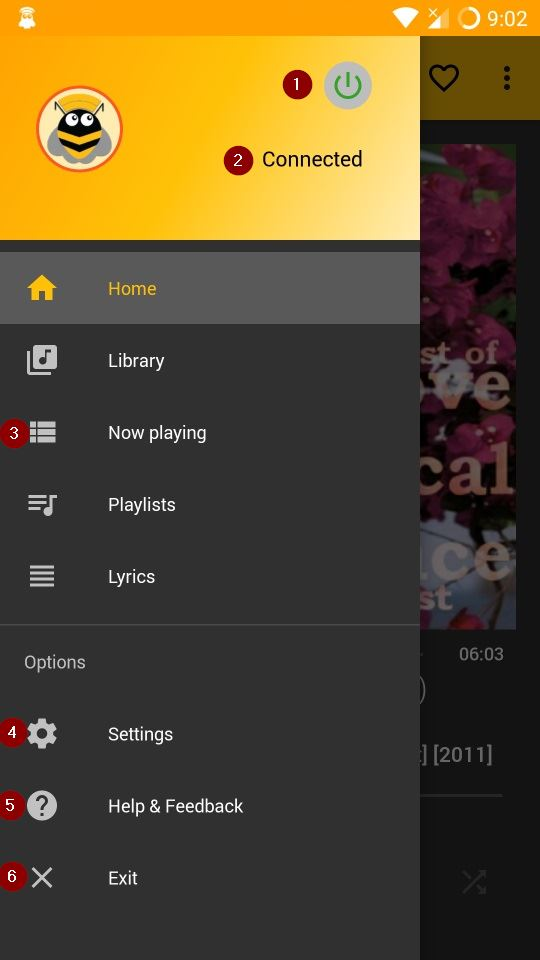

1. **Connection Button**: Despite the looks this is actually a button. Pressing it should start the connection. Long pressing it should reset the connection. When connected the power logo should have a Green color.

2. **Connection Label**: This is a complementary label that shows the current status of the connection.

3. **Basic Navigation**: This is the basic navigation menu. That you use to access all the screens of the application.

4. **Settings**: Opens the settings screen mentioned above.

5. **Help & Feedback**: Opens the Help & Feedback screen. Here you can easily access this help guide in app and also send feedback about the application.

### Library Browse Screen

Initially the library browsing screen is empty and no data will be displayed.
In order to have your metadata displayed you have to manually sync the metadata.

You can also swipe to refresh each individual tab.

> **Important!**: please keep in mind that if you don't complete the metadata sync
> the search features won't work.

The plans are to add an option for auto sync later, or autosync at least on the first connection
when there are no data available.

The sync operation might take a while depending on the size of your library.

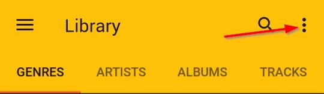

In order to refresh the library metadata you have to open the overflow menu on the
top right of the ActionBar and select the **Refresh** entry.

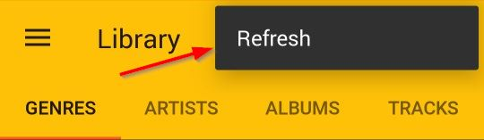

After selecting the refresh option you will have to wait until the operation completes.
This might take a while depending on your library size.

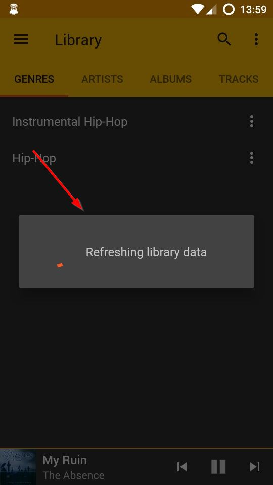

> One user reported that for 60.000 tracks this was around 20 minutes.

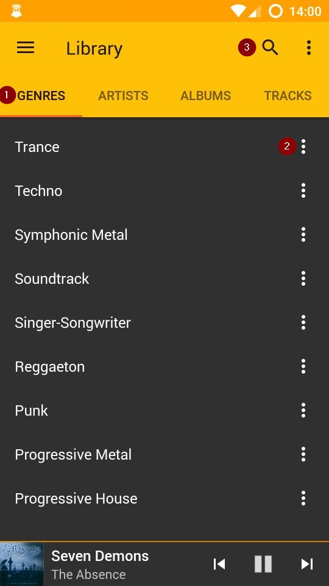

After the completion of the sync operation you should be able to see
the metadata for your library in each category **(1)**.

By default if you didn't change anything in the option pressing on one item
should open the related sub view.

- A **Genre** opens a list of all the Artists that have songs in this Genre.
- An **Artist** opens all the Albums of the Artist. _(Normally this should
  show all the albums by the artist or where the artist appears.
  Unfortunately due to a bug currently the compilations will show no data.)_
- An **Album** will list all the Tracks belonging to the Album
- Pressing a **Track** will clear the queue and play that track.

> Currently due to some code left from the previous version you can
> change what happens when you press on an entry in the library view.
> This will be changed in an upcoming update to affect only the track view.

By opening the context menu on each entry **(2)** you get the option to
either **Play Now**, **Queue Last** or **Queue Next** all the tracks
matching the specific entry. Excluding the track view you also have
the option to open the sub category results.

If you for example select to **Play Now** a **Genre** it should queue all
the tracks matching the selected Genre for playback.

The application also provides a keyword search on the library metadata **(3)**.

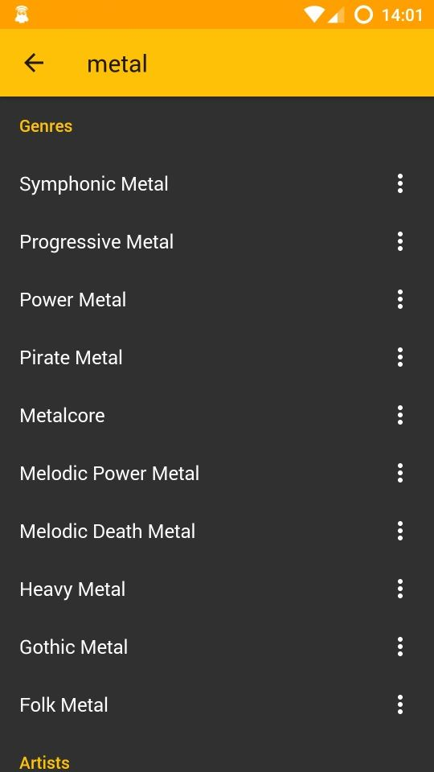

In the library search view you can see all the results fuzzily matching
your keyword grouped by the metadata field they where found.

In this view you have access to the same actions as in the Tabs of the Library Browser.

### Now Playing Screen

In the Now Playing screen you can view the Now Playing List of MusicBee.

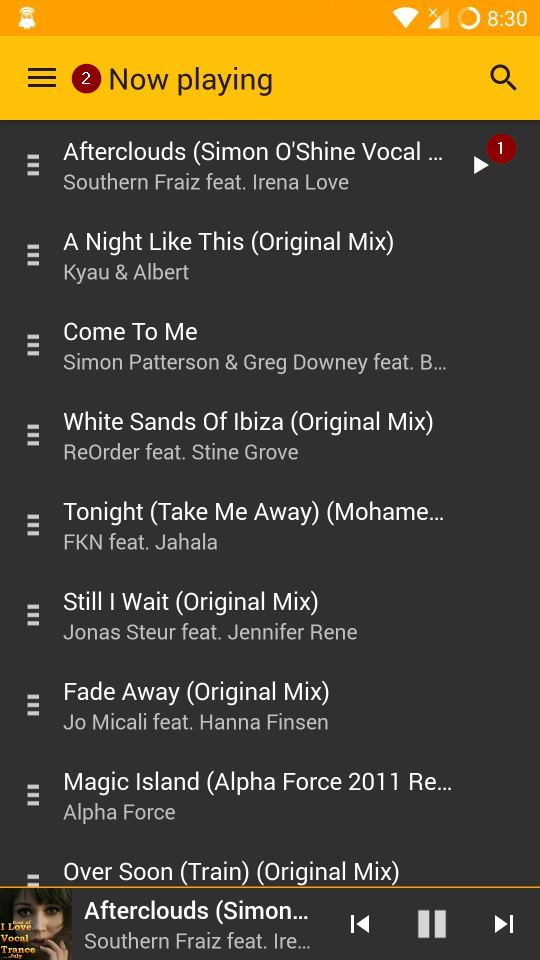

In the now playing screen you can press a track to immediately play it.
There is an indicator **(1)** of the playing track. And you can
also search for a track **(2)** that will be played immediately.

There are plans to improve the now playing search by adding the option
to automatically scroll to the entry on the now playing list.

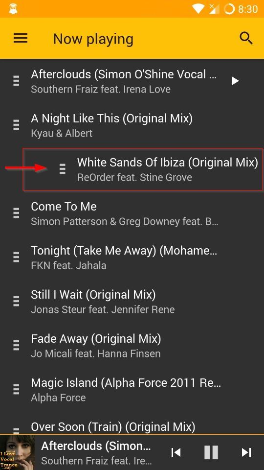

You can also remove tracks from the Now Playing list by pressing on the entry
and swiping the entry from left to right.

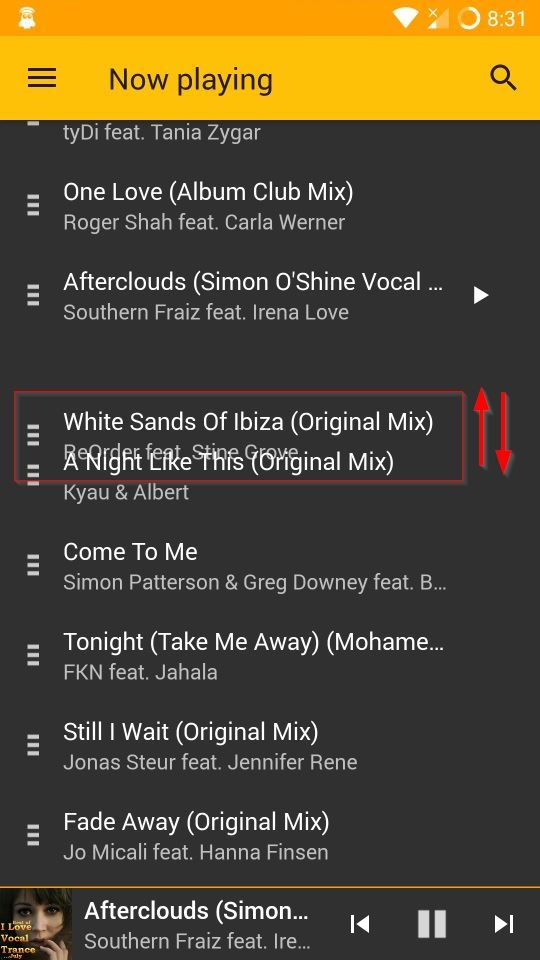

You can also reorder tracks in the Now Playing list. To start moving a track
have to long press on an entry and the start moving the track either upwards
or downwards.

### Playlists

Currently the playlists view is really simple. You can swipe to refresh
the playlists that are cached locally on your device and you can press
on a playlist in order to start playing all the tracks of the
said playlist.

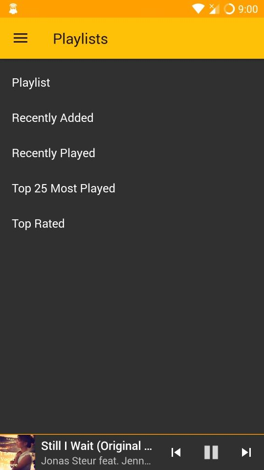

> For version v1.x there are no plans to enhance the playlist functionality.

> However for v2.x you will be able to delete playlists from the device,
> add tracks to existing playlists through the library browser, or create new playlists.
> You will also be able view the tracks for each playlist and probably also remove
> tracks from playlists.

### Extras

#### Mini Control

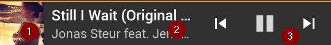

The application provides a mini control in most of the alternative screens.

In the mini control you can view the cover of the playing track **(1)**,
The basic information _(Arists, Title)_ **(2)** and you have basic playback
controls **(3)**.

By pressing on the track information you will be navigated to the main screen.

#### Notification

The application also provides media control notification.

#### LockScreen

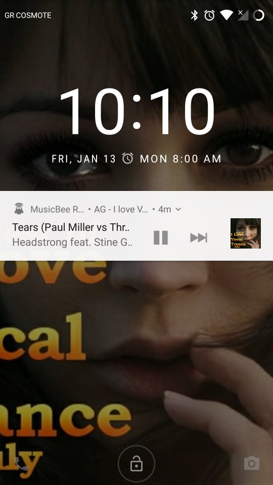

You also have a lock screen media control so you don't even need
to unlock your device to change a track.

### Lyrics

In the lyrics screen you can see the lyrics of the playing track.
The lyrics are loaded automatically when the track changes.
You can simply scroll to view all the lyrics.

